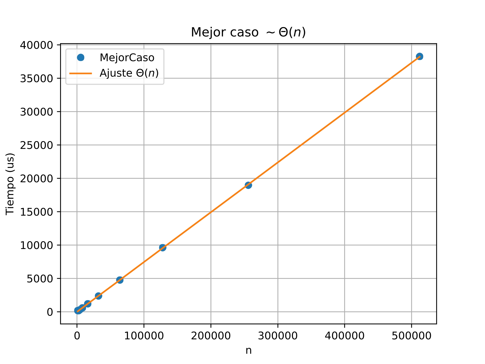
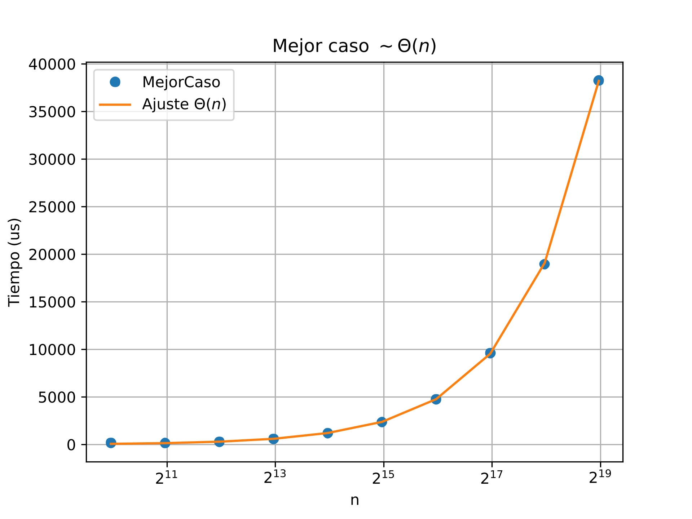

<h1 align="center">
  ✨ INFORME DE PRÁCTICAS ✨ <br> <br> 
  . ݁₊ ⊹ . ݁ ⟡ ݁ . ⊹ ₊ ݁.</span> <br> <br> <br>
       Profesor ~ Héctor Muñoz Ortiz <br>  <br>
           ˗ˏˋ ★ ˎˊ˗ <br>  <br>
          ~ Miembros del Grupo ~ <br> <br>
         🌱 Andrés Liza Pozo -> Grupo 2.3, andres.lizap@um.es <br>
         🌾 María Abellán Marín -> Grupo 2.3, m.abellanmarin@um.es <br> <br> <br> <br>
⠀⠀⠀⠀⠀⠀⠀⣀⡄⠀⠀⠀⡀⠀⠀⠀⠀⠀⠀⠀⠀⠀⡀⠀⡀⡀⠂⠂⠀⠀⠀
⠀⠀⠀⠀⠀⠀⠐⢿⠓⠀⢀⡴⡏⠀⠀⠀⠀⠀⠀⣀⠔⢂⠁⠁⠀⠀⡐⠈⠀⠀⠀
⠀⠀⠹⡒⠤⣀⡀⠀⢀⡴⠋⢠⠇⠀⠀⠀⠠⠐⠈⠀⠀⠀⠀⡀⠐⠁⡐⠁⠀⠀⠄
⠀⠀⠀⠱⡀⠀⠉⠑⠋⠀⠀⣸⠀⠀⠐⠈⠀⠀⠀⠀⠀⢀⠄⠁⢀⠂⠀⠀⠀⠨⠀
⠀⠀⠀⠀⢱⡄⠀⠀⠀⠀⠀⠉⠒⠤⣀⡀⠀⠀⠀⠀⡄⠁⠀⡀⠠⠁⠀⠀⠀⠁⠀
⠀⠀⠀⡴⠋⠀⠀⠀⠀⠀⠀⠀⠀⢀⣀⣈⠵⠦⡠⠈⠀⠀⠀⡐⠁⠀⠀⠀⠂⠀⠀
⢀⡤⠋⣀⣀⣀⣤⠀⠀⠀⢰⠋⠉⠀⠀⠀⢀⠂⠀⠀⠀⠈⠠⠀⠀⠀⠀⠰⡁⠀⠀
⠈⠉⠁⠀⠀⠀⠀⢧⠀⠀⡏⠀⠀⠀⠀⠔⠁⠀⠀⠀⠀⡐⠀⠀⠀⠀⠀⠅⠀⠀⠀
⠀⢐⣶⣆⠀⠀⢠⠈⢇⢰⠃⠀⠀⠄⠁⠀⠀⢀⠀⢀⠂⠀⠀⣰⡄⠀⠂⠐⠀⠀⠀
⠀⠈⠙⠀⠀⠀⣏⣧⠈⠟⠀⢀⠁⠀⠀⠀⠽⡿⠆⠇⠀⠀⢀⣿⣿⣦⣶⣶⠟⠀⠀
⠀⠀⠀⠀⣀⣸⣿⣯⢧⠤⣤⣦⣴⠦⠀⠀⠀⠁⠀⠀⠛⠿⣿⣿⣿⣿⣿⡁⠀⠀⠀
⠀⠙⠯⡻⣿⣿⣿⣿⣿⣿⡿⠟⠁⠀⠰⣄⣠⡇⠀⠂⠀⠀⢸⣿⡿⠛⠛⠿⣆⠀⠀
⠀⠀⠀⠈⢻⣿⣿⣿⣿⣿⠁⠀⠀⠀⣠⢿⣿⠟⠒⠀⠀⠀⠸⠊⠁⠀⢐⠀⠀⠀⠀
⠀⠀⠀⠀⡾⣿⠿⠺⢝⡯⢧⠀⠀⠀⠀⠀⠻⠀⠀⠀⠂⠀⠀⠀⠀⡐⠂⠀⠀⠠⠁
⠀⠀⠀⢼⠓⠁⠀⠀⠀⠉⠺⠆⠀⠀⠀⠀⠀⠀⠀⡸⠀⠀⢀⢿⠐⠀⠀⠀⡐⠁⠀
⠀⠀⠀⠀⠀⠀⠀⠀⠀⠀⠀⠀⠀⠀⠀⠀⠀⠀⢀⠂⠀⠀⡜⡌⡇⠀⠀⡐⠀⠀⠀
⠀⠀⠀⠀⠀⠀⠀⠀⠀⠀⠀⠀⠀⠀⠀⠀⠀⠙⢟⡒⠒⠛⠁⠀⠘⠒⠒⢲⡶⠂⠀
⠀⠀⠀⠀⠀⠀⠀⠀⠀⠀⠀⠀⠀⠀⠀⠀⣤⣖⠀⠈⢢⠀⠀⠀⠀⡤⠛⠁⠀⠀⠀
⠀⠀⠀⠀⠀⠀⠀⠀⠀⠀⠀⠀⠀⠀⠀⠈⠻⠉⠀⢠⠇⢀⡤⣀⠌⢳⠀⠀⠀⠀⠀
⠀⠀⠀⠀⠀⠀⠀⠀⠀⠀⠀⠀⠀⠀⠀⠀⠀⠀⠀⡿⠊⠁⠀⠈⠳⣼⡄⠀⠀⠀⠀
⠀⠀⠀⠀⠀⠀⠀⠀⠀⠀⠀⠀⠀⠀⠀⠀⠀⠀⠀⠀⠀⠀⠀⢀⠂⠈⠉⠀⠀⠀⠀
⠀⠀⠀⠀⠀⠀⠀⠀⠀⠀⠀⠀⠀⠀⠀⠀⠀⠀⠀⠀⠀⠀⢰⡆⠀⣀⠀⠀⢀⣄⡀
⠀⠀⠀⠀⠀⠀⠀⠀⠀⠀⠀⠀⠀⠀⠀⠀⠀⠀⠀⠀⠀⠶⢾⣿⣟⠁⠀⠀⠺⡟⠃
⠀⠀⠀⠀⠀⠀⠀⠀⠀⠀⠀⠀⠀⠀⠀⠀⠀⠀⠀⠀⠀⠀⢻⡏⢉⠓⠀⠀⠀⠀⠀

</h1>


# ‼️ Antes del Informe

### Aclaraciones previas 🫡
¡Holi!  <br> <br> 
Este informe/memoria de prácticas ha sido realizado por un humano (yo :3) a quien le gusta mucho usar los guiones largos (—) y los puntos y comas (;) para insertar aclaraciones. Te prometo que no soy ChatGPT, simplemente me parece bonito usarlos (no sé dar una explicación a eso, pero queda guay). <br> <br>
Dicho lo cual, espero que disfrutes leyendo nuestro informe de prácticas. <br> <br>
Atte. Aris y Andy <3⠀<br>
˗ˏˋ ★ ˎˊ
<br> 
### ÍNDICE
[inserte índice]⠀⠀⠀⠀⠀⠀⠀⠀⠀⠀⠀⠀⠀⠀⠀<br> <br>⠀⠀⠀⠀⠀⠀⠀⠀

# 📚 Enunciado del problema.

Dada una cadena $A$ con $n$ caracteres y un conjunto $S$ de 5 caracteres distintos, hay que encontrar todas las subcadenas de $A$ formadas por 3 elementos de $S$ sin repetir. Habrá que devolver como solución el número de subcadenas y su posición en la cadena $C$. Por ejemplo, si

$A = abbfabcddfcbbade$ <br> $n=16$

Si consideramos un conjunto de cinco caracteres <br>$S={a, b, c, d, e}$

La solución es $4$, en las posiciones $5, 6, 13$ y $14$ <br> <br> <br>

# 🖍️ Diseño.

Al diseñar el algoritmo que resuelve este problema nos hemos basado en dos pseudocódigos previamente creados por nosotros, uno **iterativo** y otro con la estrategia de “***Divide y Vencerás***” <br> <br> <br>

## 🐌 Diseño Iterativo.

Para una cadena $A$ de $n$ caracteres, el algoritmo va agrupando los caracteres de 3 en 3 y comparando que:

- Ninguno esté repetido.
- Todos los caracteres pertenezcan a $S$.

Una vez hechas estas comprobaciones —si éstas se cumplen— se añadirá el índice a la lista de subcadenas y se incrementa en $1$ el contador.

```cpp
/*
* Entrada:
*   - A: cadena de caracteres
*   - n: entero, longitud de A
*   - S: conjunto de 5 caracteres
* Salida:
*   - subcadenas: número de subcadenas que cumplen las condiciones
*   - posiciones: lista de las posiciones iniciales de subcadenas
*/

FUNCIÓN encontrarSubcadenasIterativo(A, n, S):
        Lista<Entero> posiciones = Vacío
        Entero subcadenas = 0

        // Si n=16, vamos del carácter 0 al 13, pues solo pueden formarse grupos de 3 en esas
        // posiciones 
        PARA c DESDE 0 HASTA n-3 HACER:
                Caracter a1 = A[c]
                Caracter a2 = A[c+1]
                Caracter a3 = A[c+2]

                // Condición 1: Que no haya duplicados
                SI (a1 == a2) O (a1 == a3) O (a2 == a3) HACER:
                        SEGUIR
                FIN SI

                // Condición 2: Que todos pertenezcan a S
                SI (a1 NO PERTENECE A S) O (a2 NO PERTENECE A S) O (a3 NO PERTENECE A S) HACER:
                        SEGUIR
                FIN SI
                // Si ambas condiciones se cumplen, contamos la subcadena y almacenamos su índice

                posiciones.añadir(c)
                subcadenas++

        FIN PARA

        DEVOLVER subcadenas, posiciones
FIN FUNCIÓN
``` 
<br> <br> <br>

## 🦔 Diseño DyV .

El algoritmo de **Divide y Vencerás** se basa en la idea de:

> *Coger una cadena, dividirla a la mitad y comprobar las condiciones en ambas subcadenas; seguidamente, realizar las mismas comprobaciones en la subcadena del centro.*
> 

Las condiciones a comprobar son:

- Ningún elemento esté repetido.
- Todos los caracteres pertenezcan a $S$.

```cpp
FUNCIÓN encontrarSubcadenasDyV(A, inicio, fin, S)

        Lista<Entero> posiciones = Vacío
        Entero subcadenas = 0

        // CASO BASE: Si la longitud de la cadena es menor que 3, no se pueden formar subcadenas de 3 caracteres
        Entero n = fin - inicio + 1
        SI n < 3 HACER:
                DEVOLVER subcadenas, posiciones
        FIN SI

        // DIVIDIR Y VENCER: Dividir la cadena en dos mitades y resolver recursivamente cada mitad
        Entero medio = inicio + n / 2
        Entero subcadenasIzquierda, posicionesIzquierda = encontrarSubcadenasDyV(A, inicio, medio-1, S)
        Entero subcadenasDerecha, posicionesDerecha = encontrarSubcadenasDyV(A, medio, fin, S)

        // Comprobar subcadenas que cruzan el punto medio
        Entero subcadenasMedio = 0
        Lista<Entero> posicionesMedio = Vacío

        PARA c DESDE medio-2 HASTA medio-1 HACER:

                // Asegurarse de que no se salga de los límites de la cadena
                SI c < inicio O c + 2 > fin HACER:
                        SEGUIR
                FIN SI

                Caracter a1 = A[c]
                Caracter a2 = A[c+1]
                Caracter a3 = A[c+2]

                SI (a1 == a2) O (a1 == a3) O (a2 == a3) HACER:
                        SEGUIR
                FIN SI

                SI (a1 NO PERTENECE A S) O (a2 NO PERTENECE A S) O (a3 NO PERTENECE A S) HACER:
                        SEGUIR
                FIN SI

                posicionesMedio.añadir(c)
                subcadenasMedio++

        FIN PARA

        // Combinar resultados y devolverlos
        subcadenas = subcadenasIzquierda + subcadenasDerecha + subcadenasMedio
        posiciones = posicionesIzquierda + posicionesDerecha + posicionesMedio
        DEVOLVER subcadenas, posiciones

FIN FUNCIÓN
```
<br> <br> <br>

# 🐤 Implementación.
El proyecto tiene asociados los siguientes ficheros:
- **main.cpp** ~ Fichero principal donde está todo el código en C++. <br>
    _Este fichero se encuentra en: <br> https://github.com/AriTheKai/AED2-Proyecto-DyV/blob/main/main.cpp_
<br> <br> <br>

# 📣 Validación.

## Casos de Prueba.
  **_Cadena S->_**  " $a, b, c, d, e$ " <br><br>
- **MEJOR CASO VÁLIDO:** Cadena de $3$ caracteres que pueden formar una subcadena <br>
    _Ejemplo:_ " $acd$ " <br>
    Salida esperada: ${1}$, { ${0}$ } <br> <br>
    
- **CASO DEMASIADO CORTO:** Cadena de menos de $3$ caracteres
    _Ejemplo:_ " $ab$ " <br>
    Salida esperada: $0$, {CONJUNTO VACÍO}. <br> <br>

- **MEJOR CASO INVÁLIDO:** Cadena de $3$ caracteres que no pertenecen a $S$
    _Ejemplo:_ " $zyx$ " <br>
    Salida esperad: $0$, {CONJUNTO VACÍO} <br> <br>

- **PEOR CASO:** Cadena de más de $3$ caracteres que NO puede formar ninguna subcadena <br>
    _Ejemplo:_ " ${aaabbc}$ " <br>
    Salida esperada: $0$, {CONJUNTO VACÍO} <br> <br>
    
- **CASO INTERMEDIO:** Existe una única subcadena, dentro de una cadena de más de $3$ caracteres. <br>
    _Ejemplo:_ " ${aabbde}$ " <br>
    Salida esperada: ${1}$, { ${4}$ } <br> <br>
    
- **CASO TOTAL:** Toda la cadena introducida puede ser dividida en subcadenas. <br>
    _Ejemplo:_ " ${abcde}$ " <br>
    Salida esperada: ${3}$, { ${0, 1, 2}$ } <br><br>
 
## Casos aleatorios.

En la carpeta [inserte enlace a la carpeta] tenemos los ficheros de los casos de prueba aleatorios.
### ¿Cómo funciona?
Cada función genera una cadena aleatoria con longitud de 5, 10, 20, 50, 100 o 1000 caracteres. A estas cadenas les aplica los algoritmos de DyV e Iteración
<br> <br> <br>

<br> <br> <br>
# 🔍 Análisis teórico.
El tiempo del algoritmo en el que se basa este codigo viene dado por la ecuación: [Teniendo en cuenta que _inicio_ = 'i'  y  _fin_ = f]
$n = f - i + 1$
Al dividirlo en $\lfloor \frac{(i+f)}{2} \lfloor$ se crean dos subproblemas, el izquierdo y el derecho. De esta manera tenemos que:
$t(n) = t(n_1) + t(n_2)+ f(n) \rarrow t(n)$ 

# 🔬 Análisis experimental
Se han considerado tamaños de cadena del tipo $n = 1000 * 2^k$ con $k = 0, 1, ..., 10$. Para cada tamaño de cadena se han generado 10 casos de prueba aleatorios y se han medido sus tiempos de ejecución y calculado su mediana. \

Cada caso de prueba se compone de un **"mejor caso"** y un **"peor caso"** con respecto al tiempo de ejecución. Siendo de este modo el mejor caso aquel en el que la cadena no forma ninguna subcadena válida: $aaaaa...$, y el peor caso aquel en el que la cadena forma el máximo número de subcadenas válidas: $abcdeabcde...$. Las funciones utilizadas son las siguientes, encontradas en el fichero [tiempos.cpp](https://github.com/AriTheKai/AED2-Proyecto-DyV/blob/main/tiempos.cpp)

```cpp
string generarMejorCaso(int longitud) {

    string cadena;

    for (int i = 0; i < longitud; i++)
    {
        char c = 'a'; // Genera solo el caracter 'a'
        cadena += c;
    }

    return cadena;

}
```

```cpp
string generarPeorCaso(int longitud) {

    string cadena;

    for (int i = 0; i < longitud; i++)
    {
        char c = 'a' + (i % 5); // Genera caracteres ciclicos de 'a' a 'e'
        cadena += c;
    }

    return cadena;

}
```

En la siguiente imagen se muestran los resultados obtenidos para ambos casos. Esta gráfica se ha realizado usando el script de Python en el fichero [regresion.py](https://github.com/AriTheKai/AED2-Proyecto-DyV/blob/main/regresion.py). También mostramos la misma gráfica pero con una escala logarítmica en el eje de las ordenadas para apreciar mejor la diferencia entre ambos casos.

| Gráfica de tiempos | Gráfica de tiempos con escala logarítmica |
|---|---|
|  |  |

# 🌑 Contraste.
<br> <br> <br>

# 🃏 Conclusión y Valoración Personal.
## Uso de la IA


